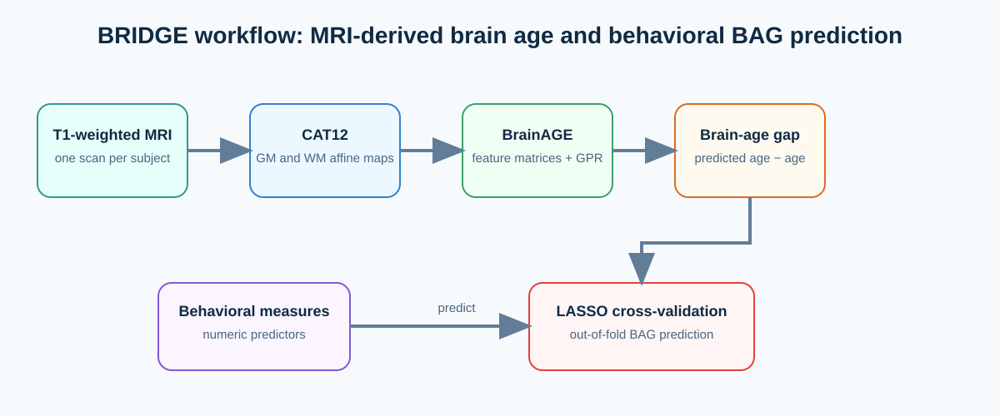

# BRIDGE

**Behavioral Risk Indicators Driving Brain Age Gap Estimation** is a set of example scripts for a CAT12/BrainAGE workflow and an exploratory analysis that predicts brain-age gap (BAG) from behavioral variables.

The repository provides glue code around the external CAT12, SPM12, and BrainAGE toolboxes. It does **not** include those toolboxes, MRI data, trained reference models, or behavioral spreadsheets. The paths embedded in the scripts point to the original author's computer and must be changed before use.



## What is included

| File | Purpose |
| --- | --- |
| `run_cat12_batch.m` | Runs a saved CAT12 segmentation batch once per T1-weighted scan. |
| `cat12_batch_template.mat` | CAT12 batch template used by `run_cat12_batch.m`. |
| `organize_cat12_output.sh` | Collects CAT12 affine GM (`rp1`) and WM (`rp2`) images. Review and set its paths before running. |
| `cat12_BrAge_tables.py` | Creates age, sex, and ordered-ID text tables aligned to sorted `rp1` filenames. |
| `make_brainage_tables.py` | Duplicate of `cat12_BrAge_tables.py`, retained for compatibility. |
| `run_BA_data2mat.m` | Calls BrainAGE's external `BA_data2mat` function to make feature matrices. |
| `run_BA_gpr_ui.m` | Loads feature matrices, calls external `BA_gpr`, and writes predicted age and BAG. Its current configuration trains and tests on the same cohort. |
| `BAG_pred_kfoldCV.py` | Runs LASSO models with age-stratified outer cross-validation to predict BAG columns from numeric behavioral variables. |
| `*_sample.*`, `ABC_BrainAge_BAG.csv` | Small examples of age/sex/ID tables and the output schema; not a complete analysis dataset. |

## Requirements

- MATLAB with [SPM12](https://www.fil.ion.ucl.ac.uk/spm/software/spm12/) and [CAT12](https://github.com/ChristianGaser/CAT12).
- A local checkout of [BrainAGE](https://github.com/ChristianGaser/BrainAGE), on the MATLAB path when running `run_BA_data2mat.m` and `run_BA_gpr_ui.m`.
- Python 3 with `numpy`, `pandas`, `scikit-learn`, `matplotlib`, and an Excel reader such as `openpyxl` for the behavioral analysis.
- One T1-weighted NIfTI image per subject and a metadata CSV containing `ID`, `Age`, and optionally `Male` (0/1) or `Sex` (`Male`/`Female`).

No dependency lock file or automated test suite is currently provided.

## Workflow

### 1. Run CAT12 preprocessing

Arrange one image per subject, for example:

```text
session1/
  ABC1001/T1_ABC1001.nii
  ABC1002/T1_ABC1002.nii
```

From the directory containing the subject folders, make a stable list of images:

```bash
find "$PWD" -maxdepth 2 -type f -name 'T1_*.nii' | sort > subj_list_paths.txt
head subj_list_paths.txt
wc -l subj_list_paths.txt
```

Open `run_cat12_batch.m` and set `spm_path`, `template_batch`, `subj_list_file`, and `logfile`. In MATLAB, run it after confirming that the batch template exports affine DARTEL GM and WM maps. Downstream scripts expect `rp1*_affine.nii` and `rp2*_affine.nii` in each subject's `mri/` directory.

On macOS, CAT12 distributed from the internet may need its quarantine attribute removed before MATLAB can execute it:

```bash
sudo xattr -r -d com.apple.quarantine /path/to/spm12/toolbox/cat12
```

### 2. Assemble BrainAGE inputs and metadata tables

Set the source and output locations in `organize_cat12_output.sh`, then run it from a shell. It copies the affine GM and WM maps into `rp1_CAT12.9/` and `rp2_CAT12.9/` beneath its configured output directory. Confirm both folders have the expected, equal number of files.

Set `outbase` and `ages_csv` in `cat12_BrAge_tables.py`, then run:

```bash
python3 cat12_BrAge_tables.py
```

The script sorts `rp1` filenames, derives subject IDs, and writes these files to `<outbase>/tables/`:

- `ages.txt` — chronological ages, one per line.
- `male.txt` — male indicator, one per line; if sex is absent, the script currently writes zeros.
- `ordered_ids.txt` — the subject order used by the two tables.

Before continuing, verify that every subject was matched to metadata. A missing ID is written as `NaN` in `ages.txt` and should be corrected rather than passed downstream. The order of `rp1`, `rp2`, ages, sex, and IDs must remain identical.

### 3. Create feature matrices and estimate age

Edit the base directory and settings in `run_BA_data2mat.m`; run it from a MATLAB session where `BA_data2mat` is on the path. The checked-in settings use both tissue classes and generate 4 mm/8 mm resampled, 4 mm/8 mm smoothed feature matrices.

Then edit `run_BA_gpr_ui.m` so its directory, basename, release string, segments, resolution, smoothing, and tables directory match the files just generated. It writes a CSV with these columns:

```text
ID, Age, PredictedAge, BAG
```

Here, `BAG = PredictedAge - Age`; a positive value means an older predicted brain age than chronological age, and a negative value means a younger predicted brain age.

Important: the provided `run_BA_gpr_ui.m` is configured to use the same cohort as both training and test data. Its estimates are therefore in-sample and should not be presented as externally validated brain-age predictions. Use a separate, appropriate reference-training cohort and validate the BrainAGE configuration for generalizable inference.

### 4. Predict BAG from behavioral measures

Edit `BEHAVIOR_PATH`, `BRAINAGE_PATH`, and `FIG_DIR` near the top of `BAG_pred_kfoldCV.py`. Both inputs must be Excel workbooks and share a `Subject_ID` column. The brain-age workbook must also contain `Age` and at least one target column ending in `_BAG` (for example, `Global_BAG`). Numeric columns remaining after identifiers, age, brain-age fields, and BAG fields are used as behavioral predictors.

Run:

```bash
python3 BAG_pred_kfoldCV.py
```

For each `_BAG` target, the script performs a shuffled five-fold outer `StratifiedKFold`, stratifying participants into age quantile bins. Median imputation and `LassoCV` are fit within each training fold. It saves out-of-fold predictions, predicted-versus-observed plots, mean absolute LASSO coefficients, and a summary with cross-validated R², MAE, and Pearson correlation. The target must have enough observations in every age stratum for five folds.

`ABC_BrainAge_BAG.csv` illustrates the final age-prediction output, but uses `ID`, not `Subject_ID`, and has a `BAG` column rather than the `_BAG` suffix required by this Python script. Rename/transform columns or update the script before using that sample as an input.

## Notes and limitations

- This is a workflow template, not a turnkey reproducible analysis package: paths, datasets, CAT12 batch options, and BrainAGE model choices are study-specific.
- `organize_cat12_output.sh` should be inspected after configuration; its current source contains an obsolete malformed copy line that must be removed or corrected before execution.
- The behavioral script does not standardize predictors even though one original input filename suggests standardized data. Scale predictors appropriately before interpreting LASSO coefficients.
- Age-based stratification is not validation across sites, scanners, or populations. Avoid leakage in all preprocessing and feature-selection decisions.

## References

- [CAT12](https://github.com/ChristianGaser/CAT12)
- [BrainAGE](https://github.com/ChristianGaser/BrainAGE)
- Gaser et al. (2013); Franke and Gaser (2019)
